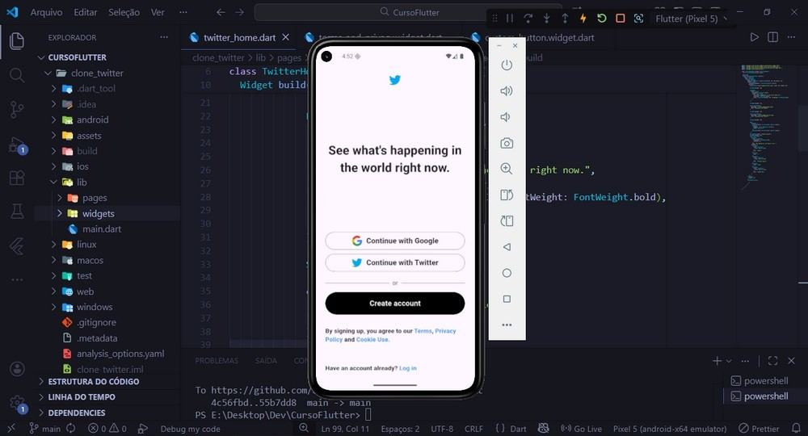

# 🐦 Twitter Clone (UI)

Este projeto é um clone da interface do Twitter (X), desenvolvido para fins de estudo e prática de desenvolvimento mobile com **Flutter**.

O foco principal foi reproduzir a fidelidade visual das telas de login e home, utilizando widgets nativos e estruturação de layout.

## 📱 Screenshots

<div align="center">
   
</div>

## 🛠️ Tecnologias Utilizadas

* **Flutter** (Framework UI)
* **Dart** (Linguagem)
* **Android Studio / VS Code** (IDE e Emulação)

## ✨ Funcionalidades / Conceitos Aplicados

* [x] Estruturação de layouts complexos com `Column`, `Row` e `Stack`.
* [x] Uso de `Text.rich` e `TextSpan` para textos com múltiplos estilos (como o link de "Log in").
* [x] Widgets de entrada de dados (TextField).

## 🚀 Como rodar este projeto

   - ## 💻 Pré-requisitos

Antes de começar, certifique-se de ter as seguintes ferramentas instaladas em sua máquina:

* **[Git](https://git-scm.com):** Para clonar o repositório.
* **[Flutter SDK](https://flutter.dev/docs/get-started/install):** O kit de desenvolvimento do Flutter.
* **[Android Studio](https://developer.android.com/studio):** IDE oficial para rodar o emulador Android.

> **Nota:** Verifique se o Flutter está configurado corretamente rodando `flutter doctor` no seu terminal. Ele indicará se falta instalar algo.

## 🚀 Guia de Instalação e Execução

Siga o passo a passo abaixo para rodar o projeto na sua máquina.

### 1. Clonar o Repositório

Abra o seu terminal (Prompt de Comando ou PowerShell) e execute:

```bash
git clone [https://github.com/aleehblackstar/clone_twitter.git](https://github.com/aleehblackstar/clone_twitter.git)